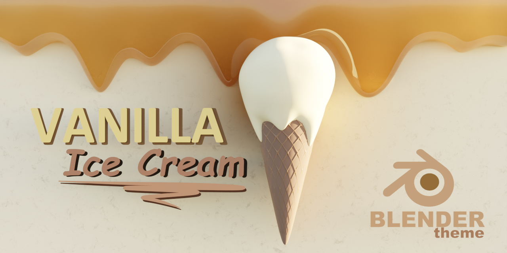
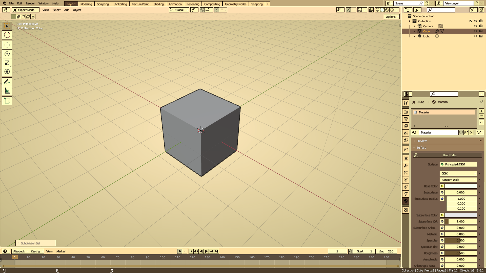
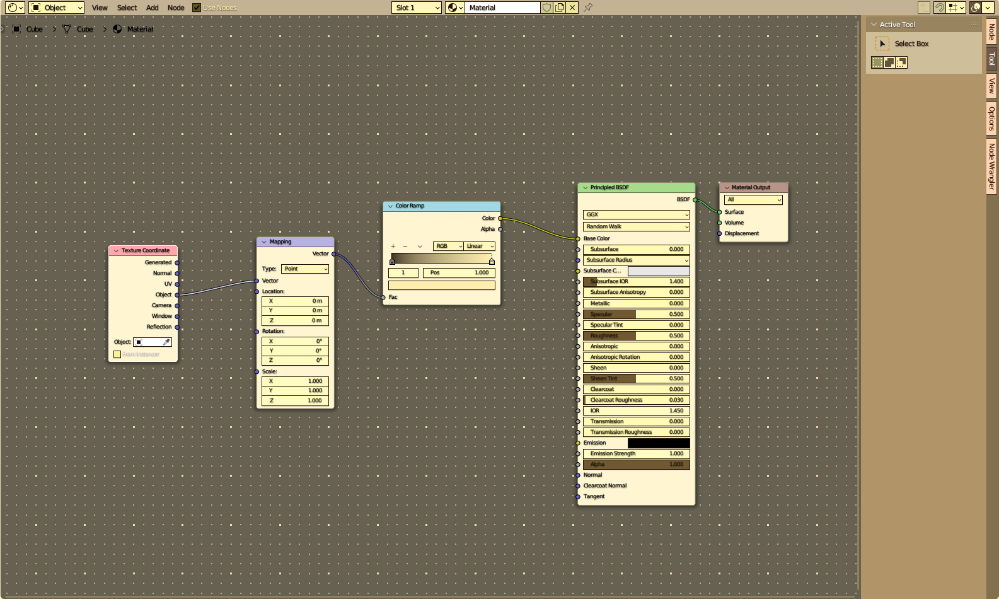
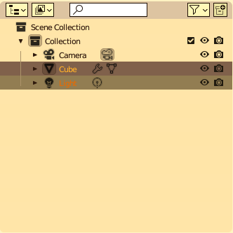
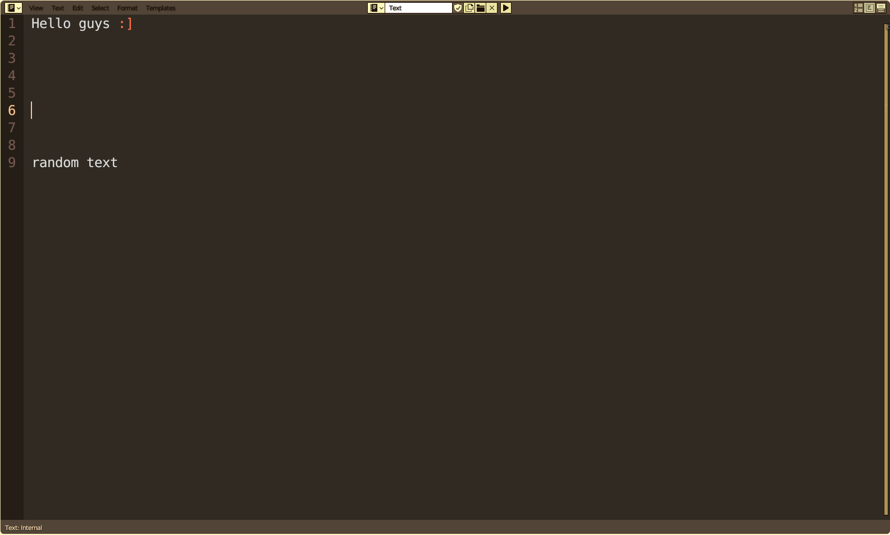

<h1 align="center">🍦Vanilla Ice Cream blender theme🍦</h1>

 flat and modern vanilla ice cream theme for blender 3.6+

    <ul>
        <li>🍨 Ice Cream Colors: The color scheme of Blender Vanilla Ice Cream has been carefully chosen to resemble the soft and comforting tones of vanilla ice cream, with hints of creamy white, pastel yellow, and ivory, creating a warm atmosphere during your creative sessions.</li>
        <li>🍧 Syrupy Hues: Selected areas showcase subtle touches of color, like syrup drizzled over delicious ice cream, bringing attention to important elements such as buttons and active selections.</li>
    </ul>
 <h2>How to download?</h2>  
 
<ol> 
<li>
Acess <a>Releases</a>.
 </li>
<li>
Find the latest release.
 </li>
</ol>

<h2>How to install? </h2>
<ol> 
<li>Unzip the theme file</li>
<li>Open blender and go to <code>Edit > Preferences > Themes > Install</code>.</li>
<li>Search for the <code>.xml</code> from the unziped file.</li>
<li>Select <code>Vanilla ice cream</code> from the themes dropdown.</li>
</ol>

<h2> Screenshots </h2>

 
Indulge in the sweetness of Blender Vanilla Ice Cream theme as you dive into a modeling and animation experience that is as smooth and enjoyable as savoring the perfect vanilla ice cream! 🍦😊
 
